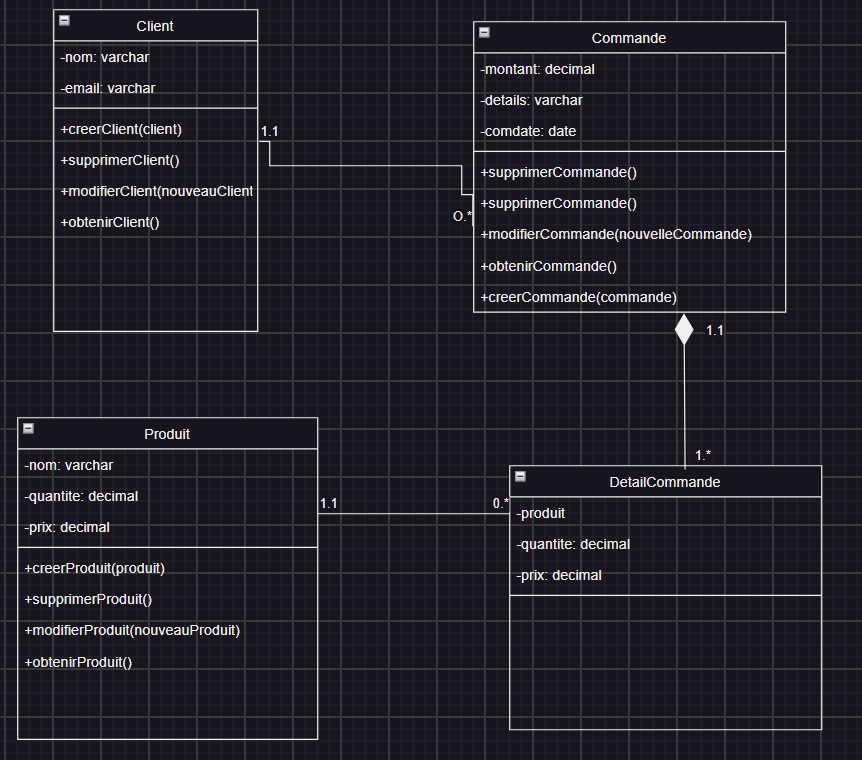

# Gestion de Commandes

Cette application est un projet de gestion de commandes utilisant Express.js et un modèle de données basique comprenant des clients, des produits, des commandes et des détails de commande. Elle sert à démontrer l'utilisation d'Express pour créer une API RESTful en Node.js.


## Prérequis

Avant de commencer, assurez-vous d'avoir les éléments suivants installés sur votre machine :

- [Node.js](https://nodejs.org/) (version 14.x ou supérieure)
- [npm](https://www.npmjs.com/) (Node Package Manager)

## Installation

1. Clonez le repository du projet sur votre machine locale :

   ```bash
   git clone https://github.com/FatimataAliouSall/Gestion-commande.git
   cd exo1-express

   ```

2. Installez les dépendances nécessaires en utilisant npm :

   ```bash
   npm install  
   ```

## Exécution

Pour exécuter l'application, utilisez la commande suivante :

```bash
npm start
```

## Modélisation du projet

 


 ##  Auteur 

 Fatimata Aliou Sall [https://github.com/FatimataAliouSall/Gestion-commande.git]
